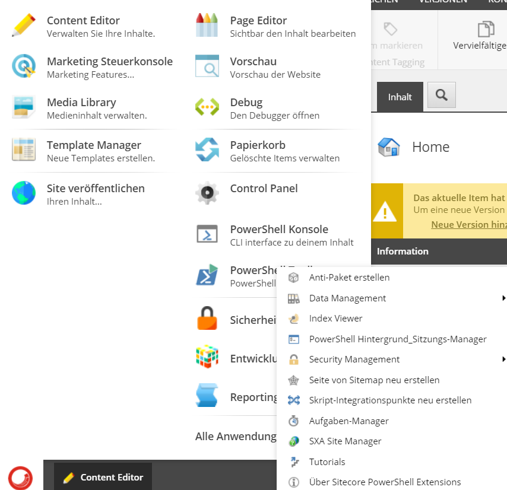

# Sitecore-Powershell-Extensions
This repository contains general files for Sitecore Powershell Extensions.

## Localization

Contains language specific translations for Sitecore Powershell Extensions. Feel free to become a contributor and add more languages here! At the moment only the german translations are available.

### Installation

Download the language files and move them to your webroot, e.g *{webroot}/localization/SPE/file.xml*

Be sure the language files you want to import is available as language in your Sitecore Instance in core and master database, e.g. *"de-DE"*.

> There are two files available, one for the core database and one for the master database, you have to repeat the steps for each database!

In your Sitecore Instance go to the control panel and choose *"Import languages"*:

Choose the language from Sitecore which you want to import:

Choose the correct database corresponding to the file:

Hit the "Import"-Button and the language will be imported.

The result looks like this:

